# PC Parts Tracker Database Project

## Project Description

This project is about modeling PC components to allow users to understand how different parts of a PC work together and what is required to create your own PC. Using this database, users will be able to look up the price of different PC parts and customize their own PC. They can add parts to the tables to keep track of the parts that they want and get some summary query results from the parts they have added such as filtering for keyboards by their brand, colour, percentage and price, finding keyboards and mouses that have the same colour or brand, and finding the average, maximum, or minimum price of GPU(s) based on brand or number of fans.

When users provide text input in this project, it is sanitized through a bounding SQL function which treats the inputs as strings first. By doing this, there is no worry about users accidentally deleting or editing the tables. This also acts as to prevent those intentionally trying to delete tables.

## How to Use

1. Here is the home page where you can switch between the 3 different tabs using the navigation bar and reset the tuples using `Reset` button.
     
      

2. When inserting new PC parts, simply add the required fields into the appropriate text boxes and click `Insert`. Here we are adding a CPU Cooler called `Model 1` with size 100, price 19.99 and cooling CPU `new cpu model`.

      

      

   
3. To delete a current PC part, input the CPU Model you would like to remove and press `Delete`. Here we are deleting the `Ryzen 5 5600X` CPU.

      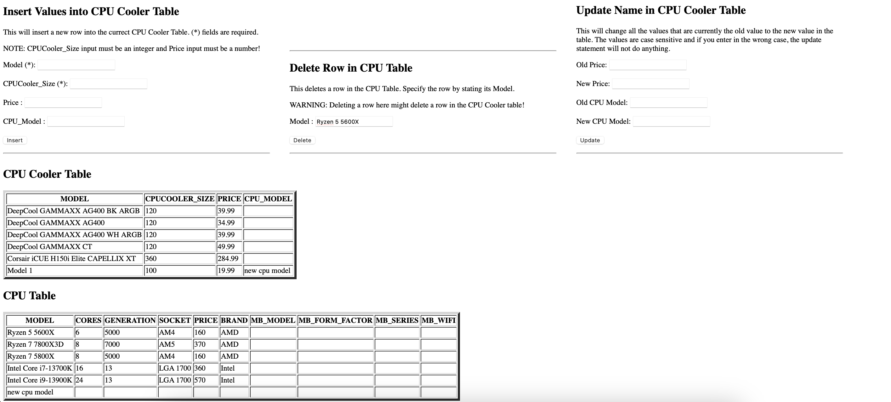

      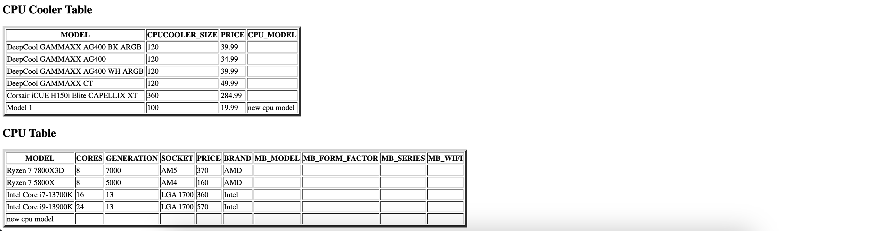

4. To update the price of a PC part, specify the old price you want to change and the new price you want to change it to and click `Update`. Here we are updating all the CPU fans with a price of $284.99 to a new price of $250.00.

      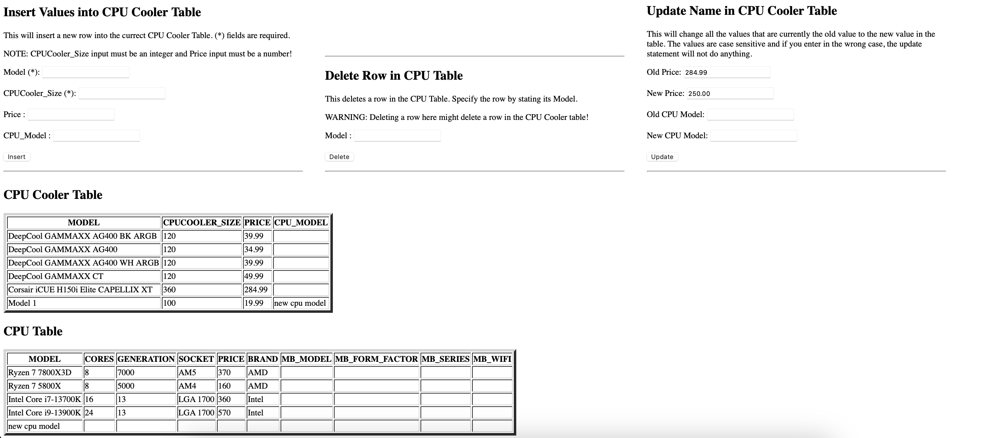

      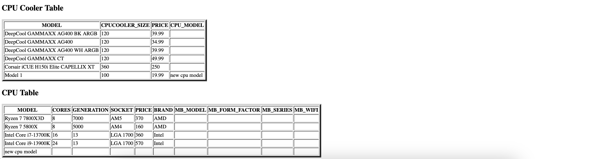

5. To filter for keyboards with a specific brand, colour, percentage or price, check the filters you want to apply and click `Find Keyboards`. Below, we are finding keyboards with the of Corsair or Logitech that are black or white with a 100 percentage size and are under $100.

      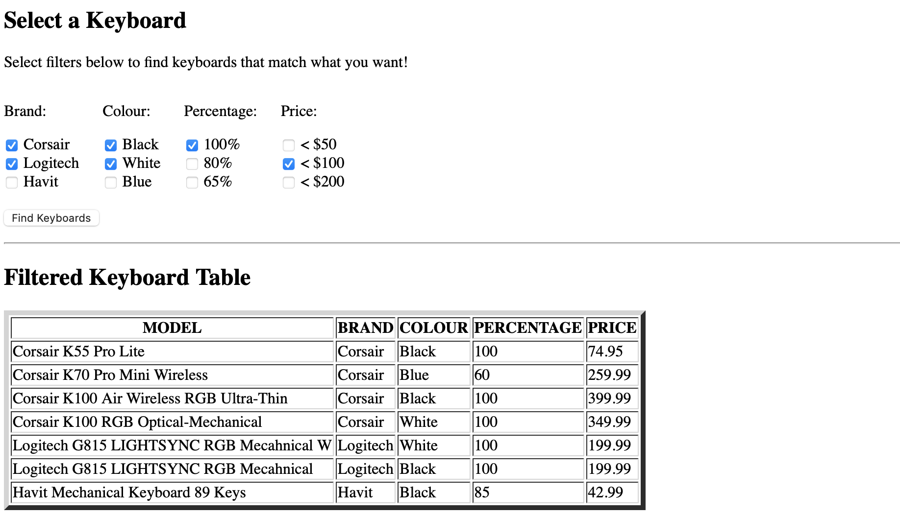

      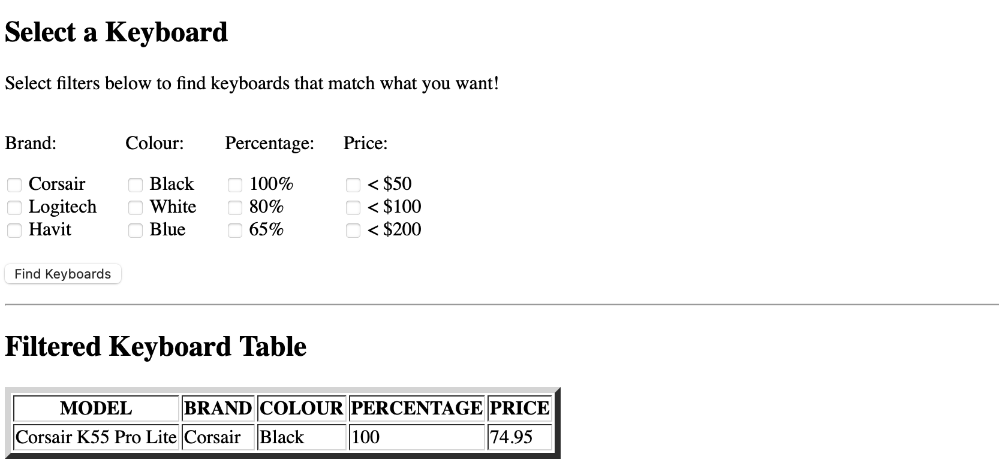

6. To see any table in the database, pick the table from the dropdown, click `Show Columns` then check off the attribute you would like to see. Here we are looking at the `Mouse` table and selecting the columns : Model, Brand, Mouse_Size, and Weight.

      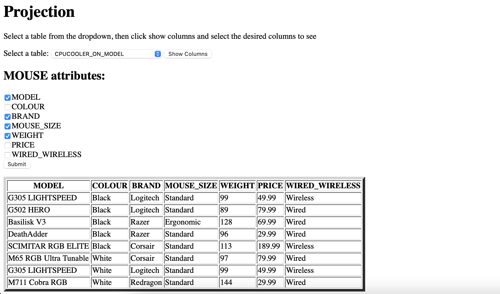

      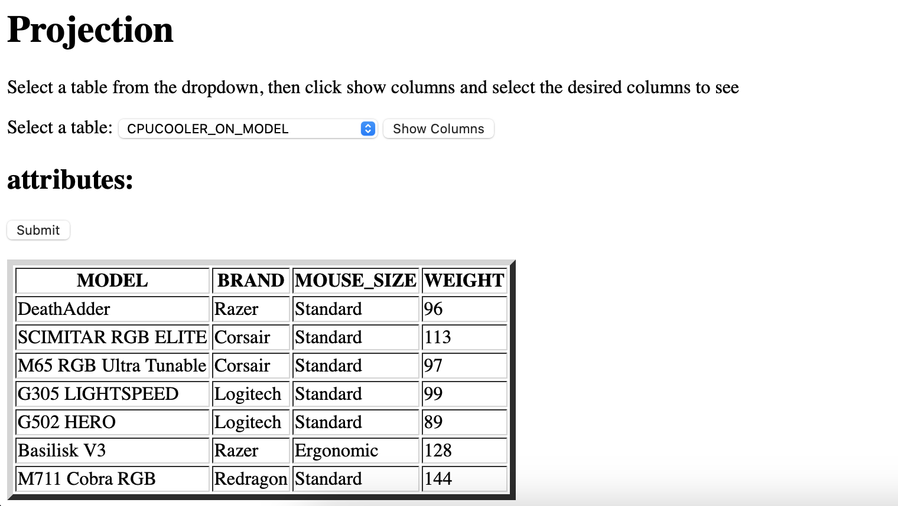

7. To find a keyboard and mouse pair that have the same colour, brand or both, input your desired brand and/or colour and press `Find`. Below we are finding keyboards and mouse pairs that both have the brand `Corsair` and are both `black`.

      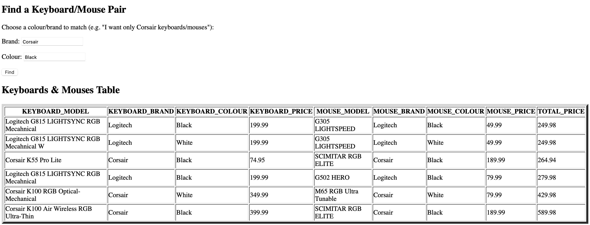

      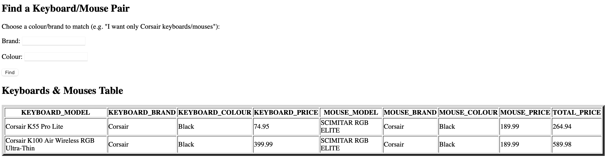

8. To find the maximum, minimum, or average price of GPUs based on their brand and/or number of fans, check off the attributes you want to group by and select the operation (max, min, avg) and click `Submit`. Here we are grouping by `brand` and finding the `average` price for each brand.

      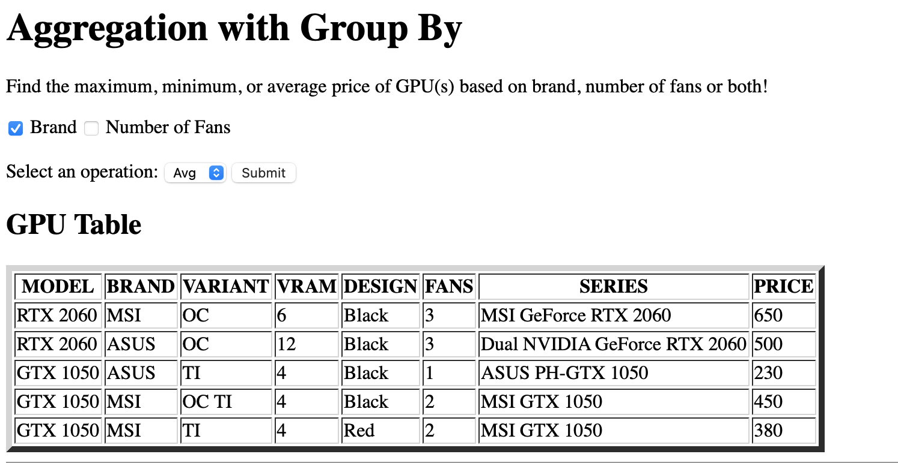

      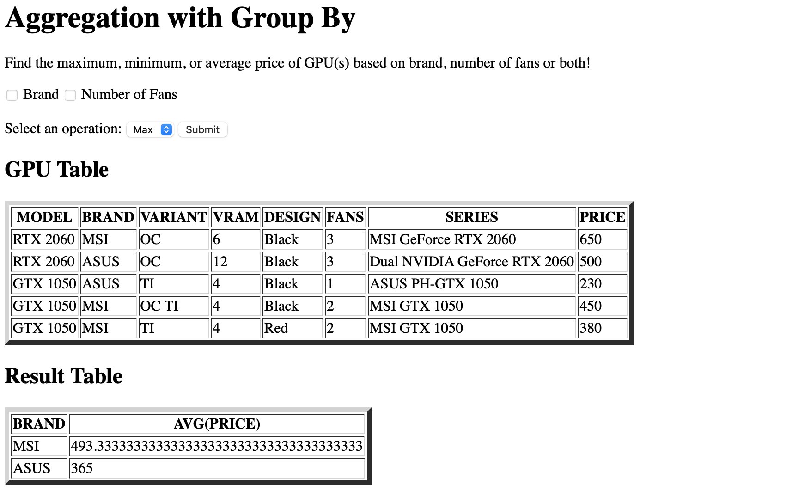

9. To search for case fan colours that have an average price less than a certain value, input that price in the text box and click `Submit`. Here we are looking for case fan colours with an average price less than $30.

      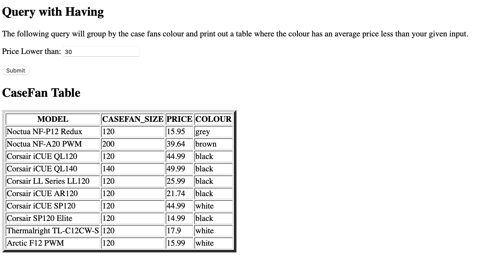

      

10. To determine which brand and colour of keyboards have a lower average price than the average price of all keyboards, check off the attributes you want to group by and press `Subimt`. Below we are grouping by `brand` and `colour`.

      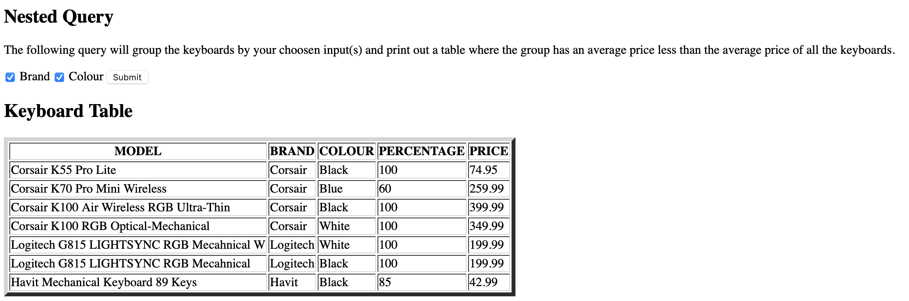

      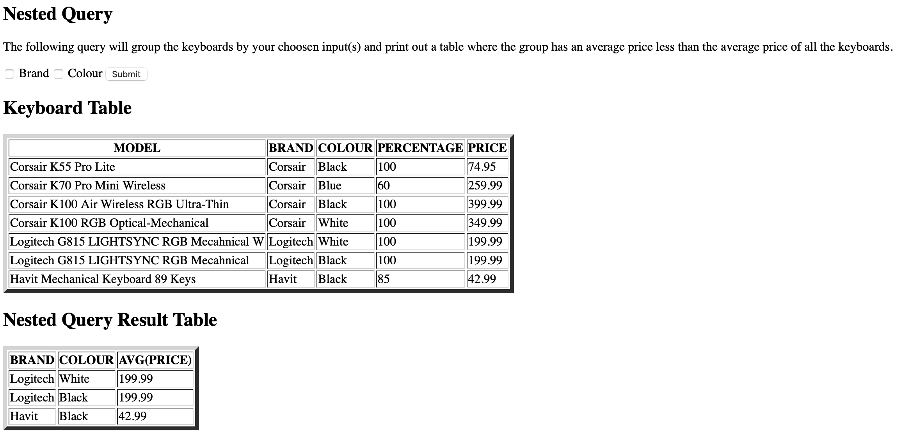

## Implementation

This project is done entirely using PHP along with Oracle as the database management system. 

## Milestone 1

This milestone was the introduction of the project. Here the idea was brought together and the first draft of the ER diagram was created.

## Milestone 2

Milestone 2 included improvements to the ER diagram to ensure that it models real PC parts more accurately. These improvements were guided by the feedback we received from our mentor. In addition, the ER diagram was translated into the appropriate relational model. From there, each table was decomposed into BCNF (Boyce-Codd Normal Form) by breaking down the tables on their functional dependencies. Finally, the SQL/DDL statements for creating each normalized table were drafted along with the states for inserting 5 tuples into each one.

## Milestone 3

Here, the team created a timeline for how to implement the rest of the project.

## Milstone 4

Milestone 4 included the implementation of the entire project. The first step was creating the sql script that would drop all the existing tables, recreate them, and initialize them with the base tuples we have chosen. Once that was done, we started designed the frontend of our project with the idea of keeping it user friendly and minimalistic. With that in mind, we implemented various operations for users to perform on the database such as adding, deleteing, and updating new PC parts, finding keyboards and mouse that are from a certain brand/colour, etc. Once we finished implementing all the functionality, we separated the functions into three separte pages so that it is easier for users to operate.
